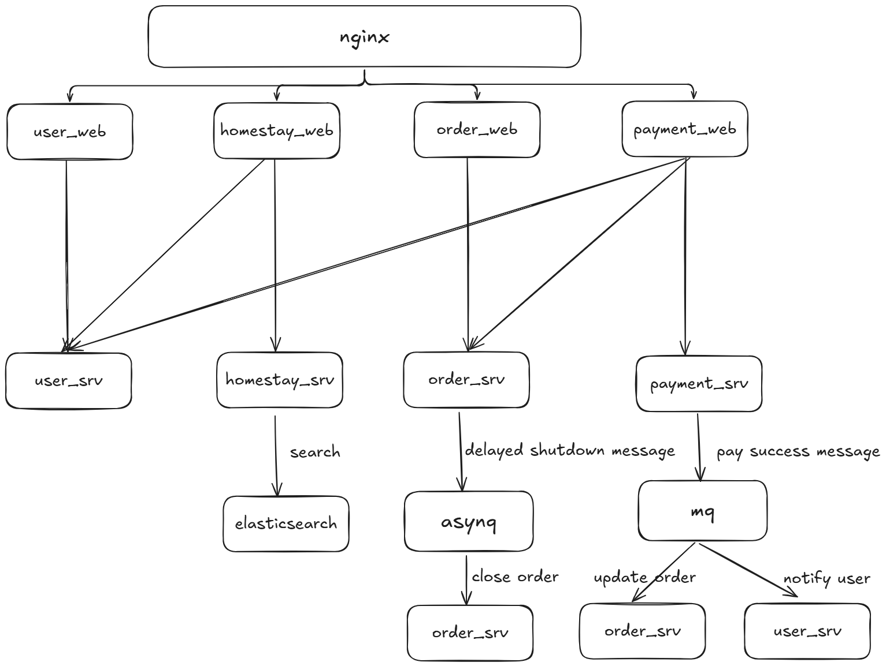
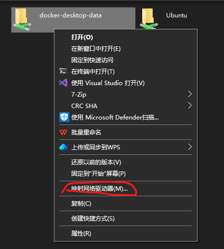

## Dependencies


## Consul KV

StayEaseGo/user_srv
```json
{
  "name": "user_srv",
  "mysql": {
    "host": "mysql",
    "port": 3306,
    "user": "root",
    "password": "root",
    "db": "StayEaseGo",
    "salt": "123"
  },
  "redis": {
    "host": "redis",
    "port": 6379
  }
}
```

StayEaseGo/user_web

```json
{
  "name":"user_web",
  // "otel":{
  //   "endpoint":"localhost:4317"
  // },
  "user_srv":{
    "name":"user_srv"
  },
  "jwt":{
    "key":"test"
  }
}
```

StayEaseGo/homestay_srv
```json
{
  "name":"homestay_srv",
  // "otel":{
  //   "endpoint":"localhost:4317"
  // },
  "mysql": {
    "host": "mysql",
    "port": 3306,
    "user": "root",
    "password": "root",
    "db": "StayEaseGo",
    "salt": "123"
  },
  "es":{
    "host":"es",
    "port":9200
  }
}
```

StayEaseGo/homestay_web
```json
{
  "name":"homestay_web",
  // "otel":{
  //   "endpoint":"localhost:4317"
  // },
  "user_srv":{
    "name":"user_srv"
  },
  "homestay_srv":{
    "name":"homestay_srv"
  }
}
```

StayEaseGo/order_srv
```json
{
  "name":"order_srv",
  // "otel":{
  //   "endpoint":"localhost:4317"
  // },
  "mysql": {
    "host": "mysql",
    "port": 3306,
    "user": "root",
    "password": "root",
    "db": "StayEaseGo"
  },
  "homestay_srv":{
    "name":"homestay_srv"
  },
  "kafka":{
    "brokers":["kafka:9092"]
  },
  "redis": {
    "host": "redis",
    "port": 6379
  }
}
```

StayEaseGo/order_web
```json
{
  "name":"order_web",
  // "otel":{
  //   "endpoint":"localhost:4317"
  // },
  "order_srv":{
    "name":"order_srv"
  }
}
```

StayEaseGo/payment_srv
```json
{
  "name":"payment_srv",
  // "otel":{
  //   "endpoint":"localhost:4317"
  // },
  "mysql": {
    "host": "mysql",
    "port": 3306,
    "user": "root",
    "password": "root",
    "db": "StayEaseGo"
  },
  "kafka":{
    "brokers":["kafka:9092"]
  }
}
```

StayEaseGo/payment_web
```json
{
  "name":"payment_web",
  // "otel":{
  //   "endpoint":"localhost:4317"
  // },

  "jwt":{
    "key":"test"
  },
  "wx_mini":{
    "AppId":"wxe1ea796246f1df67",
    "Secret":"7f6f688ca75e7794728a5a2acaf3361b"
  },
  "wx_pay":{
    "MchId":"1305638280",
    "SerialNon":"013467007045764",
    "APIv3Key":"013467007045764",
    "PrivateKey":"",
    "NotifyUrl":"http://localhost/api/v1/pay/wxpay/callback"
  },
  "order_srv":{
    "name":"order_srv"
  },
  "payment_srv":{
    "name":"payment_srv"
  },
  "user_srv":{
    "name":"user_srv"
  }

}
```


StayEaseGo/mq
```json
{
  "name":"mq",
  "kafka":{
    "brokers":["kafka:9092"]
  },
    "order_srv":{
    "name":"order_srv"
  },
    "user_srv":{
    "name":"user_srv"
  }
}
```

StayEaseGo/asynq
```json
{
  "name":"asynq",
  "order_srv":{
    "name":"order_srv"
  },
  "redis": {
    "host": "redis",
    "port": 6379
  }
}
```


todo:
1. error handling: fmt.Errof("%w")  pkg/errors库 包含堆栈信息
2. wsl的container log在: \\wsl$\docker-desktop-data\data\docker\containers，filebeat监控不到

解决方法: 

  

  在windows资源管理器中选择映射到网络驱动器，比如映射到了Z:，然后在wsl中执行 `sudo mount -t drvfs Z: /mnt/docker`即可,对应的container log即为 `/mnt/docker/data/docker/containers`